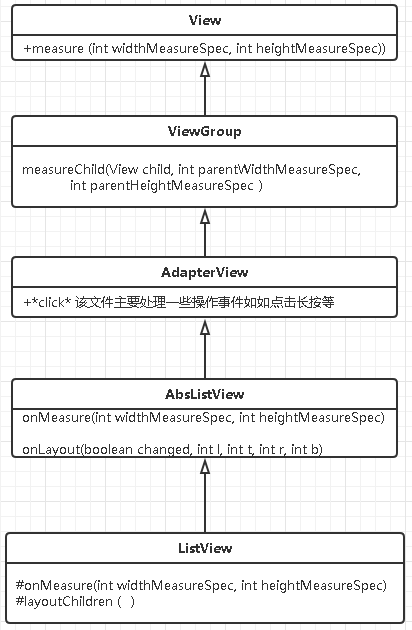
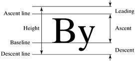

# listview 绘制原理
## listview的数据管理器之Adapter
Adapter是一个Interface负责管理listview的item包括构建itemview等。
## listview类结构


> 其中 Adapter 主要负责listview相关的 Event 事件处理，各种click。

### listview Item 的布局。

listview的布局本质是通过item布局来显示的，
 
 - 首先在AbsListView.java 中 onlayout方法。

 ```
@Override
    protected void onLayout(boolean changed, int l, int t, int r, int b) {
        super.onLayout(changed, l, t, r, b);

        mInLayout = true;

        final int childCount = getChildCount();
        if (changed) {
            for (int i = 0; i < childCount; i++) {
                getChildAt(i).forceLayout();
            }
            mRecycler.markChildrenDirty();
        }

        layoutChildren();//对子view进行布局。❶

        mOverscrollMax = (b - t) / OVERSCROLL_LIMIT_DIVISOR;

        // TODO: Move somewhere sane. This doesn't belong in onLayout().
        if (mFastScroll != null) {
            mFastScroll.onItemCountChanged(getChildCount(), mItemCount);
        }
        mInLayout = false;
    }
 ```

 - 在listview中执行layoutChildren（）

 ```
 @Override
    protected void layoutChildren() {//❶
        ...
         switch (mLayoutMode) {//这里的mLayoutMode是布局模式，也即填充位置top、bottom、select、etc.
             ...
            case LAYOUT_FORCE_BOTTOM:
                sel = fillUp(mItemCount - 1, childrenBottom);
                adjustViewsUpOrDown();
                break;
            case LAYOUT_FORCE_TOP:
                mFirstPosition = 0;
                sel = fillFromTop(childrenTop);//从top开始布局❷
                adjustViewsUpOrDown();
                break;
            case LAYOUT_SPECIFIC:
            ...
        ...
//这fillFromTop中 首先找到第一位置，然后开始往下填充。
private View fillFromTop(int nextTop) {//❷
        mFirstPosition = Math.min(mFirstPosition, mSelectedPosition);
        mFirstPosition = Math.min(mFirstPosition, mItemCount - 1);
        if (mFirstPosition < 0) {
            mFirstPosition = 0;
        }
        return fillDown(mFirstPosition, nextTop);//❸
    }
 //这里是填充布局的具体实现。
    /**
     * Fills the list from pos down to the end of the list view.
     *
     * @param pos The first position to put in the list
     *
     * @param nextTop The location where the top of the item associated with pos
     *        should be drawn
     *
     * @return The view that is currently selected, if it happens to be in the
     *         range that we draw.
     */
    private View fillDown(int pos, int nextTop) {//❸
        View selectedView = null;

        int end = (mBottom - mTop);
        if ((mGroupFlags & CLIP_TO_PADDING_MASK) == CLIP_TO_PADDING_MASK) {
            end -= mListPadding.bottom;
        }

        while (nextTop < end && pos < mItemCount) {
            // is this the selected item?
            boolean selected = pos == mSelectedPosition;
            //测量item的size然后计算下一个item的起始高度。❹
            View child = makeAndAddView(pos, nextTop, true, mListPadding.left, selected);

            //计算下一个item的top位置。
            nextTop = child.getBottom() + mDividerHeight;
            if (selected) {
                selectedView = child;
            }
            pos++;
        }

        setVisibleRangeHint(mFirstPosition, mFirstPosition + getChildCount() - 1);
        return selectedView;
    }
    //❹
    private View makeAndAddView(int position, int y, boolean flow, int childrenLeft,
            boolean selected) {
        if (!mDataChanged) {
            // Try to use an existing view for this position.
            final View activeView = mRecycler.getActiveView(position);//从recycle中获取
            if (activeView != null) {
                // Found it. We're reusing an existing child, so it just needs
                // to be positioned like a scrap view.
                setupChild(activeView, position, y, flow, childrenLeft, selected, true);
                return activeView;
            }
        }

        // Make a new view for this position, or convert an unused view if
        // possible.
        final View child = obtainView(position, mIsScrap);//如果recycle中没有那就从调用getView()

        // This needs to be positioned and measured.
        setupChild(child, position, y, flow, childrenLeft, selected, mIsScrap[0]);//❺

        return child;
    }

    //❺
        private void setupChild(View child, int position, int y, boolean flowDown, int childrenLeft,
            boolean selected, boolean isAttachedToWindow) {
//这里是设置item的状态值。
        final boolean isSelected = selected && shouldShowSelector();
        final boolean updateChildSelected = isSelected != child.isSelected();
        final int mode = mTouchMode;
        final boolean isPressed = mode > TOUCH_MODE_DOWN && mode < TOUCH_MODE_SCROLL
                && mMotionPosition == position;
        final boolean updateChildPressed = isPressed != child.isPressed();
        final boolean needToMeasure = !isAttachedToWindow || updateChildSelected
                || child.isLayoutRequested();

        // Respect layout params that are already in the view. Otherwise make
        // some up...
        AbsListView.LayoutParams p = (AbsListView.LayoutParams) child.getLayoutParams();
        if (p == null) {
            p = (AbsListView.LayoutParams) generateDefaultLayoutParams();
        }
        p.viewType = mAdapter.getItemViewType(position);
        p.isEnabled = mAdapter.isEnabled(position);

        // Set up view state before attaching the view, since we may need to
        // rely on the jumpDrawablesToCurrentState() call that occurs as part
        // of view attachment.
        if (updateChildSelected) {
            child.setSelected(isSelected);
        }

        if (updateChildPressed) {
            child.setPressed(isPressed);
        }

        if (mChoiceMode != CHOICE_MODE_NONE && mCheckStates != null) {
            if (child instanceof Checkable) {
                ((Checkable) child).setChecked(mCheckStates.get(position));
            } else if (getContext().getApplicationInfo().targetSdkVersion
                    >= android.os.Build.VERSION_CODES.HONEYCOMB) {
                child.setActivated(mCheckStates.get(position));
            }
        }
//把item添加到listview中也就是viewgroup。

        if ((isAttachedToWindow && !p.forceAdd) || (p.recycledHeaderFooter
                && p.viewType == AdapterView.ITEM_VIEW_TYPE_HEADER_OR_FOOTER)) {
            attachViewToParent(child, flowDown ? -1 : 0, p);

            // If the view was previously attached for a different position,
            // then manually jump the drawables.
            if (isAttachedToWindow
                    && (((AbsListView.LayoutParams) child.getLayoutParams()).scrappedFromPosition)
                            != position) {
                child.jumpDrawablesToCurrentState();
            }
        } else {
            p.forceAdd = false;
            if (p.viewType == AdapterView.ITEM_VIEW_TYPE_HEADER_OR_FOOTER) {
                p.recycledHeaderFooter = true;
            }
            addViewInLayout(child, flowDown ? -1 : 0, p, true);
            // add view in layout will reset the RTL properties. We have to re-resolve them
            child.resolveRtlPropertiesIfNeeded();
        }
//对子类进行测量size
        if (needToMeasure) {
            final int childWidthSpec = ViewGroup.getChildMeasureSpec(mWidthMeasureSpec,
                    mListPadding.left + mListPadding.right, p.width);
            final int lpHeight = p.height;
            final int childHeightSpec;
            if (lpHeight > 0) {
                childHeightSpec = MeasureSpec.makeMeasureSpec(lpHeight, MeasureSpec.EXACTLY);
            } else {
                childHeightSpec = MeasureSpec.makeSafeMeasureSpec(getMeasuredHeight(),
                        MeasureSpec.UNSPECIFIED);
            }
            child.measure(childWidthSpec, childHeightSpec);//❻
        } else {
            cleanupLayoutState(child);
        }

        final int w = child.getMeasuredWidth();
        final int h = child.getMeasuredHeight();
        final int childTop = flowDown ? y : y - h;

        if (needToMeasure) {
            final int childRight = childrenLeft + w;
            final int childBottom = childTop + h;
            child.layout(childrenLeft, childTop, childRight, childBottom);
        } else {
            child.offsetLeftAndRight(childrenLeft - child.getLeft());
            child.offsetTopAndBottom(childTop - child.getTop());
        }

        if (mCachingStarted && !child.isDrawingCacheEnabled()) {
            child.setDrawingCacheEnabled(true);
        }

        Trace.traceEnd(Trace.TRACE_TAG_VIEW);
    }
//❻View.java
    public final void measure(int widthMeasureSpec, int heightMeasureSpec) {
            ...
            //调用子类具体重写的方法。
            onMeasure(widthMeasureSpec, heightMeasureSpec);
            ...

 ```
 ### textview做item布局时，当gone后item显示为空白还存在的问题。
在❻这里调用的child其实我们item 通过Inflate的布局，当我使用TextView直接布局的话会调用TextView的onMeasure。
1. Textview.java onMeasure.
```
   @Override
    protected void onMeasure(int widthMeasureSpec, int heightMeasureSpec) {
        int widthMode = MeasureSpec.getMode(widthMeasureSpec);
        int heightMode = MeasureSpec.getMode(heightMeasureSpec);
        int widthSize = MeasureSpec.getSize(widthMeasureSpec);
        int heightSize = MeasureSpec.getSize(heightMeasureSpec);

        int width;
        int height;
//这里的BoringLayout是为了构造textview字体的，即使textview的text是空也有高度。
        BoringLayout.Metrics boring = UNKNOWN_BORING;
        BoringLayout.Metrics hintBoring = UNKNOWN_BORING;

        if (mTextDir == null) {
            mTextDir = getTextDirectionHeuristic();
        }

        int des = -1;
        boolean fromexisting = false;
        final float widthLimit = (widthMode == MeasureSpec.AT_MOST)
                ?  (float) widthSize : Float.MAX_VALUE;
//先测宽
        if (widthMode == MeasureSpec.EXACTLY) {
            // Parent has told us how big to be. So be it.
            width = widthSize;
        } else {
            if (mLayout != null && mEllipsize == null) {
                des = desired(mLayout);
            }

            if (des < 0) {
                boring = BoringLayout.isBoring(mTransformed, mTextPaint, mTextDir, mBoring);
                if (boring != null) {
                    mBoring = boring;
                }
            } else {
                fromexisting = true;
            }

            if (boring == null || boring == UNKNOWN_BORING) {
                if (des < 0) {
                    des = (int) Math.ceil(Layout.getDesiredWidthWithLimit(mTransformed, 0,
                            mTransformed.length(), mTextPaint, mTextDir, widthLimit));
                }
                width = des;
            } else {
                width = boring.width;
            }

            final Drawables dr = mDrawables;
            if (dr != null) {
                width = Math.max(width, dr.mDrawableWidthTop);
                width = Math.max(width, dr.mDrawableWidthBottom);
            }

            if (mHint != null) {
                int hintDes = -1;
                int hintWidth;

                if (mHintLayout != null && mEllipsize == null) {
                    hintDes = desired(mHintLayout);
                }

                if (hintDes < 0) {
                    hintBoring = BoringLayout.isBoring(mHint, mTextPaint, mTextDir, mHintBoring);
                    if (hintBoring != null) {
                        mHintBoring = hintBoring;
                    }
                }

                if (hintBoring == null || hintBoring == UNKNOWN_BORING) {
                    if (hintDes < 0) {
                        hintDes = (int) Math.ceil(Layout.getDesiredWidthWithLimit(mHint, 0,
                                mHint.length(), mTextPaint, mTextDir, widthLimit));
                    }
                    hintWidth = hintDes;
                } else {
                    hintWidth = hintBoring.width;
                }

                if (hintWidth > width) {
                    width = hintWidth;
                }
            }

            width += getCompoundPaddingLeft() + getCompoundPaddingRight();

            if (mMaxWidthMode == EMS) {
                width = Math.min(width, mMaxWidth * getLineHeight());
            } else {
                width = Math.min(width, mMaxWidth);
            }

            if (mMinWidthMode == EMS) {
                width = Math.max(width, mMinWidth * getLineHeight());
            } else {
                width = Math.max(width, mMinWidth);
            }

            // Check against our minimum width
            width = Math.max(width, getSuggestedMinimumWidth());

            if (widthMode == MeasureSpec.AT_MOST) {
                width = Math.min(widthSize, width);
            }
        }
//计算宽
        int want = width - getCompoundPaddingLeft() - getCompoundPaddingRight();
        int unpaddedWidth = want;

        if (mHorizontallyScrolling) want = VERY_WIDE;

        int hintWant = want;
        int hintWidth = (mHintLayout == null) ? hintWant : mHintLayout.getWidth();
//构建BroingLayout。
        if (mLayout == null) {
            makeNewLayout(want, hintWant, boring, hintBoring,
                          width - getCompoundPaddingLeft() - getCompoundPaddingRight(), false);
        } else {
            final boolean layoutChanged = (mLayout.getWidth() != want) || (hintWidth != hintWant)
                    || (mLayout.getEllipsizedWidth()
                            != width - getCompoundPaddingLeft() - getCompoundPaddingRight());

            final boolean widthChanged = (mHint == null) && (mEllipsize == null)
                    && (want > mLayout.getWidth())
                    && (mLayout instanceof BoringLayout
                            || (fromexisting && des >= 0 && des <= want));

            final boolean maximumChanged = (mMaxMode != mOldMaxMode) || (mMaximum != mOldMaximum);

            if (layoutChanged || maximumChanged) {
                if (!maximumChanged && widthChanged) {
                    mLayout.increaseWidthTo(want);
                } else {
                    makeNewLayout(want, hintWant, boring, hintBoring,
                            width - getCompoundPaddingLeft() - getCompoundPaddingRight(), false);
                }
            } else {
                // Nothing has changed
            }
        }
//测量高度
        if (heightMode == MeasureSpec.EXACTLY) {
            // Parent has told us how big to be. So be it.
            height = heightSize;
            mDesiredHeightAtMeasure = -1;
        } else {
            int desired = getDesiredHeight();//获取字体的高度❼

            height = desired;
            mDesiredHeightAtMeasure = desired;

            if (heightMode == MeasureSpec.AT_MOST) {
                height = Math.min(desired, heightSize);
            }
        }

        int unpaddedHeight = height - getCompoundPaddingTop() - getCompoundPaddingBottom();
        if (mMaxMode == LINES && mLayout.getLineCount() > mMaximum) {
            unpaddedHeight = Math.min(unpaddedHeight, mLayout.getLineTop(mMaximum));
        }

        /*
         * We didn't let makeNewLayout() register to bring the cursor into view,
         * so do it here if there is any possibility that it is needed.
         */
        if (mMovement != null
                || mLayout.getWidth() > unpaddedWidth
                || mLayout.getHeight() > unpaddedHeight) {
            registerForPreDraw();
        } else {
            scrollTo(0, 0);
        }

        setMeasuredDimension(width, height);
    }

//❼处的值是有boringlayout的高度计算来的，它的高度是在paint.cpp中计算的。
Paint.cpp
static jint getFontMetricsInt(JNIEnv* env, jobject, jlong paintHandle, jobject metricsObj) {
        Paint::FontMetrics metrics;

        getMetricsInternal(paintHandle, &metrics);
        int ascent = SkScalarRoundToInt(metrics.fAscent);
        int descent = SkScalarRoundToInt(metrics.fDescent);
        int leading = SkScalarRoundToInt(metrics.fLeading);

        if (metricsObj) {
            SkASSERT(env->IsInstanceOf(metricsObj, gFontMetricsInt_class));
            env->SetIntField(metricsObj, gFontMetricsInt_fieldID.top, SkScalarFloorToInt(metrics.fTop));
            env->SetIntField(metricsObj, gFontMetricsInt_fieldID.ascent, ascent);
            env->SetIntField(metricsObj, gFontMetricsInt_fieldID.descent, descent);
            env->SetIntField(metricsObj, gFontMetricsInt_fieldID.bottom, SkScalarCeilToInt(metrics.fBottom));
            env->SetIntField(metricsObj, gFontMetricsInt_fieldID.leading, leading);
        }
        return descent - ascent + leading;//这个高度就是去掉text的高度。
    }
 
```


2. LinearLayout onMeasure
```
    @Override
    protected void onMeasure(int widthMeasureSpec, int heightMeasureSpec) {
        if (mOrientation == VERTICAL) {
            measureVertical(widthMeasureSpec, heightMeasureSpec);
        } else {
            measureHorizontal(widthMeasureSpec, heightMeasureSpec);
        }
    }
//Vertical和Horizontal同理

void measureHorizontal(int widthMeasureSpec, int heightMeasureSpec) {
    ... ...
    // See how wide everyone is. Also remember max height.
        for (int i = 0; i < count; ++i) {
            final View child = getVirtualChildAt(i);
            if (child == null) {
                mTotalLength += measureNullChild(i);
                continue;
            }
            //如果子类状态是gone的话那么就会跳过测量计算。
            if (child.getVisibility() == GONE) {
                i += getChildrenSkipCount(child, i);
                continue;
            }

            nonSkippedChildCount++;
            if (hasDividerBeforeChildAt(i)) {
                mTotalLength += mDividerWidth;
            }

            final LayoutParams lp = (LayoutParams) child.getLayoutParams();

            totalWeight += lp.weight;
    ... ...
}
```

## 综上
介绍了listview的layout，以及当listview使用textview做item布局时，会出现textview状太为Gone时，item还存在为空白的问题。

[Demo 链接](https://github.com/DongXiaoFat/WorkNB/tree/master/demo/ListView_Demo)

水平有限，欢迎指正！